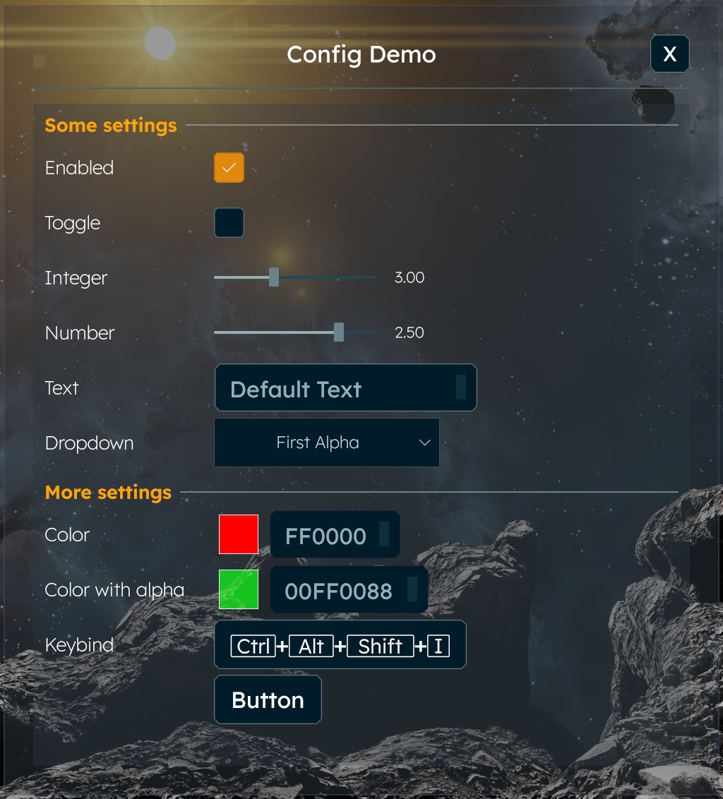

# Space Engineers 2 Client Plugin Template

## Prerequisites

- [Space Engineers 2](https://store.steampowered.com/app/1133870/Space_Engineers_2/)
- [Python 3.12](https://python.org) (requires 3.12 or newer)
- [Pulsar](https://github.com/SpaceGT/Pulsar)
- [.NET 10 SDK](https://dotnet.microsoft.com/en-us/download)

Both Windows and Linux are supported for developing the plugin. On Linux the game itself
runs through Proton, launched by Pulsar's native `Modern.bin`, but the plugin builds and
deploys natively.

## Create your plugin project

1. Click on **Use this template** (top right corner on GitHub) and follow the wizard to create your repository
2. Clone your repository to have a local working copy
3. Run `setup.py`, enter the name of your plugin project in `CapitalizedWords` format
4. Let `setup.py` auto-detect your installation location or fill it in manually
5. Open the solution in Visual Studio or Rider
6. Make a test build, the plugin's DLL should be deployed (see the build log for the path)
7. Test that the empty plugin can be enabled in Pulsar (use the `Modern` executable of Pulsar to run SE2)
8. Replace the contents of this file with the description of your plugin
9. Follow the `TODO` comments in the source file and implement your plugin

In case of questions, please feel free to ask the SE2 plugin developer community on the
[Pulsar](https://discord.gg/z8ZczP2YZY) Discord server via their relevant text channels. 
They also have dedicated channels for plugin ideas, should you look for a new one.

_Good luck!_

## Remarks

### Plugin version

The plugin version lives in `Version.Build.props`, which **is** committed and imported by
`Directory.Build.props`. Keeping the version separate from the local path overrides means it
is shared by all contributors and stays under version control. Bump the version there.

### Folder path overrides

`Directory.Build.props` **is** committed and declares the overridable folder paths with empty
defaults:

- `Game2` &mdash; the folder containing `SpaceEngineers2.exe`
- `Pulsar` &mdash; the folder containing Pulsar's data

It optionally imports `Directory.Build.props.user` from the repository root, which is **not
committed** (matched by `*.user` in `.gitignore`), so each contributor keeps their own local
paths there.

To override a path manually, copy the first `PropertyGroup` of `Directory.Build.props` into
`Directory.Build.props.user`, wrapped into a top-level `<Project>` element, and fill in your
paths. `setup.py` writes that file for you with the auto-detected install location, creating
it if needed and keeping any other overrides already in it.

Leaving a path empty (or having no `Directory.Build.props.user` at all) falls back to the
platform defaults declared after that import: the Steam install of the game (from the
registry on Windows, under `~/.steam/steam` on Linux) and Pulsar under `%AppData%\Pulsar`
or `$XDG_CONFIG_HOME`/`~/.config/Pulsar`. If your Steam library lives elsewhere, run
`setup.py` or set the path yourself; the defaults are not searched for.

A `Verify` target checks these paths before the build, so a wrong or missing one fails with
a clear message instead of a wall of unresolved references.

### Debugging

- Always use a debug build if you want to set breakpoints and see variable values.
- A debug build defines `DEBUG`, so you can add conditional code in `#if DEBUG` blocks.
- If breakpoints do not "stick" or do not work, then make sure that:
  - The debugger is attached to the running process.
  - You are debugging the code which is running.

### How to use a development folder to build the sources by Pulsar

- Start the game with the `Modern` Pulsar executable (`Modern.exe` on Windows, `Modern.bin` on Linux)
  with the `-sources` command line option.
- Click on the **Sources** button in Pulsar's dialog, then set up a development folder for your plugin.
- Make sure to fill in the PluginHub registration XML (`ClientPluginTemplate.xml` in this repo) and load that as well.
- Select `Debug` mode and run `Modern`, then attach the debugger. That should allow debugging your plugin.
- Select `Release` mode to test exactly how Pulsar will build and run your plugin on the player's machine.
- The registered development folder shows up as a plugin you can select in the plugin list and save into a profile.

### Settings UI

The template ships with an attribute-driven Settings UI generator — mark the
properties on `Config` with the built-in attributes (`[Checkbox]`, `[Slider]`,
`[Textbox]`, `[Dropdown]`, `[Color]`, `[Keybind]`, `[Button]`, `[Separator]`)
and the settings dialog is rendered automatically. See
[ClientPlugin/Settings/Settings.md](ClientPlugin/Settings/Settings.md) for the
full reference.

### Accessing internal, protected and private members in game code

Enable the Krafs publicizer to significantly reduce the number of reflections you need to write.

This can be done by systematically uncommenting the code sections marked with "Uncomment to enable publicizer support".
Make sure not to miss any of those. List the game assemblies you need to publicize in `GameAssembliesToPublicize.cs`.
In case of problems, read about the [Krafs Publicizer](https://github.com/krafs/Publicizer) or reach out on the [Pulsar](https://discord.gg/z8ZczP2YZY) Discord server.

### Preloader patching

Preloader patching is a "last resort" solution which changes the IL code before the game assemblies are even loaded.
Use preloader patching only if none of the other methods work. For example, if you have to change type or method
signatures in the game assemblies or have to change code before static constructors run.

If any plugin selected in Pulsar is using any preloader patches, then the loading of the game is slower.
If a game assembly has one patch, then having more patches to the same assembly is nearly free.

Uncomment the code in `ExamplePrepatch.cs`, read the comments there and understand how it works.

#### Limitations

It is relatively hard to write a preloader patch correctly, since all changes have to be done in IL code without 
importing any of the game assemblies. You cannot directly reference game assemblies from preloader patches, but
can write IL code referencing them once the assembly will be loaded. The `Finish` method is safe to refer game
assemblies, because that runs after all the preloader patches.

The Mono.Cecil library cannot write "mixed mode" assemblies used by the game for ReadyToRun (R2R) support.
It has been worked around in Pulsar by clearing the R2R precompiled code from the assemblies if preloader
patching is used. In the future the Mono.Cecil may be replaced with a different library as a proper solution.

### AI-assisted plugin development

There is an [AGENTS.md](AGENTS.md) file in this repository. Make sure your coding agent reads this file before working on the code.

Please consider using [se2-dev-skills](https://github.com/CometWorks/skills2/) for better outcomes.

### Troubleshooting

- If the IDE looks confused, then restarting the IDE and the debugged game usually works.
- If the restart did not work, then try to clear caches in the IDE and restart it.
- If the built DLL fails to deploy, then stop the game first, because it locks the old DLL file which prevents overwriting it.

### Release

- Always test your RELEASE build before publishing. Sometimes it behaves differently.
- Always make your final release from a RELEASE build. (More optimized, removes debug code.)
- In the case of client plugins, Pulsar compiles your code on the player's machine, so no need for a binary release.
- You should deliver any additional files as assets (see Assets folder) and instead of downloading them directly.

### Communication

- In your documentation always include how players should report bugs.
- Try to be reachable and respond in a timely manner over your communication channels.
- Be open for constructive criticism.

### Abandoning your project

- Always consider finding a new maintainer, ask around at least once.
- If you ever abandon the project, then make it clear on its GitHub page.
- You may want to archive the repository.
- Keep the code available on GitHub, so it can be forked and continued by other developers.
